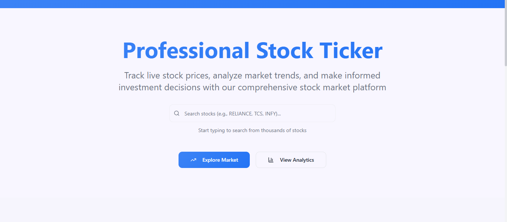
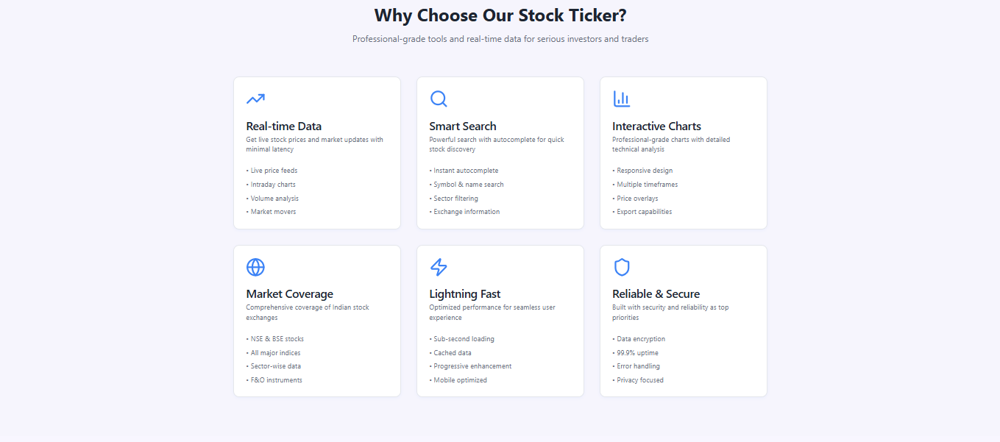
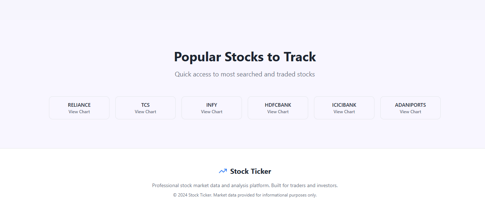
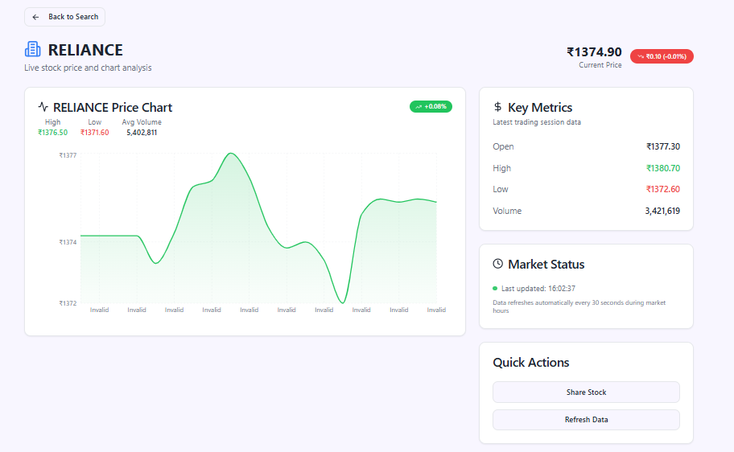
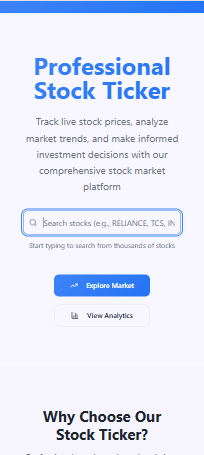

# 📈 Stock Ticker Application

A sleek, professional, and **fully functional** stock market tracker built with **React + Vite + TypeScript + Tailwind CSS**.  
It features real-time stock search, interactive charts, rolling ticker, and beautiful financial UI.

---

## 🚀 Features

- 🔍 **Smart Stock Search** — Autocomplete search with keyboard navigation
- 📊 **Interactive Charts** — Historical and intraday price charts using Recharts
- 📰 **Rolling Ticker Bar** — Always-updated market movers at the top
- 🎯 **SEO Optimized** — Dynamic meta tags and structured data
- 🛡 **Error Handling** — Graceful fallbacks when APIs fail
- 🎨 **Modern UI** — Mobile-first design with gradients, shadows, and animations

---

## 🛠 Tech Stack

- **Frontend:** React, TypeScript, Vite
- **Styling:** Tailwind CSS
- **Charts:** Recharts
- **Routing:** React Router
- **Data:** API integration (with mock data fallback)
- **SEO:** React Helmet / Custom SEO component

---

## 📂 Project Structure

```
src/
├── lib/api.ts              # API calls & mock data fallback
├── components/
│   ├── TickerBar.tsx       # Rolling ticker bar
│   ├── StockSearch.tsx     # Autocomplete stock search
│   ├── StockChart.tsx      # Interactive charts
│   └── SEOHead.tsx         # Dynamic SEO management
├── pages/
│   ├── Index.tsx           # Home page with search
│   └── StockDetail.tsx     # Dynamic stock details page
└── index.css               # Global styles
```

---

## ⚡ Getting Started

### 1️⃣ Clone the repo

```bash
git clone https://github.com/yourusername/stock-ticker.git
cd stock-ticker
```

### 2️⃣ Install dependencies

```bash
npm install
```

### 3️⃣ Start development server

```bash
npm run dev
```

Your app will be live at:

```
http://localhost:5173
```

---

## 🔗 API Setup

- This app uses a **mock API** by default.
- To connect to real data, replace the API URLs in `src/lib/api.ts` with your actual endpoints.

---

## 📸 Screenshots

### Home Page Hero Section



### Home Page Middle Section



### Home Page footer section



### Stock Search


### Stock Details



### Mobile View



**Home Page**  
_(Search stocks, view trending tickers)_

**Stock Details Page**  
_(View charts, latest price, and info)_

---

## 🚧 Future Enhancements

- 🔄 Live price updates via WebSockets
- 📅 Multiple time-range chart filters
- 📌 User watchlists
- 🗞 Financial news integration

---

## 📜 License

MIT — feel free to use and modify.
